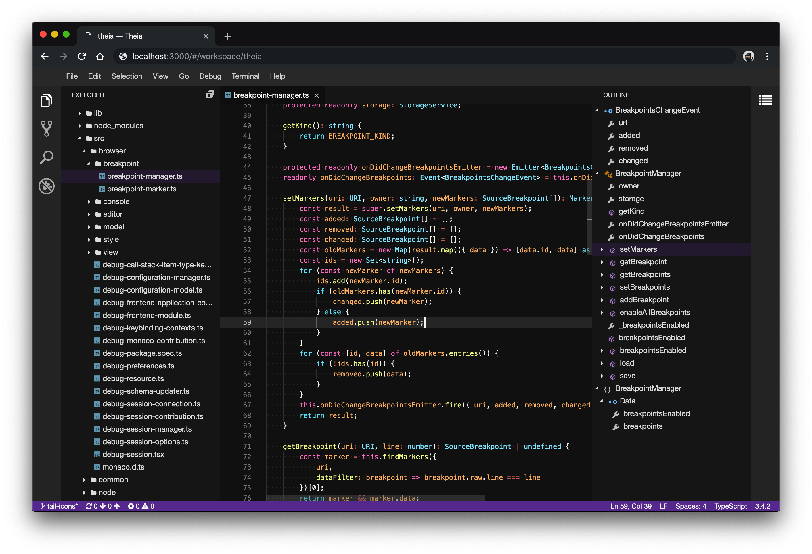

 

<h3>THEIA THEME PACK</h3>

<!-- Themes -->

|Dracula |
|:---:|
||

## Getting started

Install [nvm](https://github.com/creationix/nvm#install-script).

    curl -o- https://raw.githubusercontent.com/creationix/nvm/v0.33.5/install.sh | bash

Install npm and node.

    nvm install 8
    nvm use 8

Install yarn.

    npm install -g yarn

## Running the browser example

    yarn rebuild:browser
    cd browser-app
    yarn start

Open http://localhost:3000 in the browser.

## Running the Electron example

    yarn rebuild:electron
    cd electron-app
    yarn start